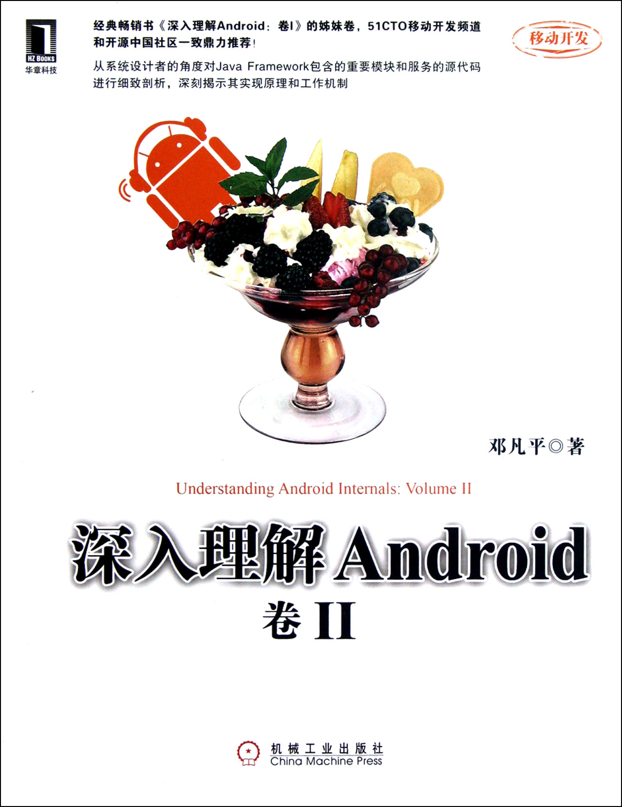

# 深入理解 Android 卷II

- 第1章，介绍了阅读本书所需要做的一些准备工作，包括Android 4.0源码下载和编译、搭建Eclipse环境，以及如何调试Android系统进程（system_process）等。
- 第2章，介绍了Java Binder和MessageQueue的实现。
- 第3章，介绍了SystemServer，并分析了图1中第5部分所包含的Service的工作原理。这些服务包括EntropyService、DropboxManagerService、DiskStatsService、DeviceStorageMonitorService、SamplingProfilerService和ClipboardService。
- 第4章，分析了PackageManagerService，该服务负责Android系统中的Package信息查询和APK安装、卸载、更新等方面的工作。
- 第5章，讲解了PowerManagerService，它是Android中电源管理的核心服务。本章对其中的WakeLock、Power按键处理、BatteryStatsService和BatteryService都做了一番较为深入的分析。
- 第6章，以ActivityManagerService为分析重点，该服务是Android 的核心服务。本章对ActivityManagerService的启动、Activity的创建和启动、BroadcastReceiver的工作原理、Android中的进程管理等方面内容展开了较为深入的研究。
- 第7章，对ContentProvider的创建和启动、SQLite相关知识、Cursor query和close的实现等，也进行了较为深入的分析。   
- 第8章，以ContentService和AccountManagerService为分析对象，介绍了数据更新通知机制的实现，账户管理和数据同步等方面的知识。   

本书通过直接剖析源代码的方式进行讲解，旨在引领读者一步步深入于Android系统中相关模块的内部原理，去理解它们是如何实现、如何工作的。在分析过程中，笔者根据个人研究Android代码的心得，采用了精简流程、逐个击破的方法。同时，笔者还提供一些难度不大的知识点、相关的补充阅读资料，甚至笔者在实际项目中遇到的开放式问题等内容，留作读者自行研究和探讨。总之，笔者希望读者在阅读完本书后，能有一下两个收获：

- 能从“基于Android并高于Android”的角度来看待和分析Android。
- 能初步具有大型复杂代码的分析能力。

## 读者对象

适合阅读本书的读者包括：   

- Android应用开发工程师:虽然应用开发工程师平常接触的多是Android SDK，但是只有更深入了解Android系统运行原理，才能写出更健壮、更高效的模块。
- Android系统开发工程师:系统开发工程师常常需要深入理解系统的运转过程，而本书所涉及的内容正是他们在工作和学习中最想了解的。那些对具体服务（如ActivityManagerService、PackageManagerService）感兴趣的读者，也可以单刀直入，阅读相关章节的内容。
- 对Android系统运行原理感兴趣的读者:这部分读者需要有基本的Android开发知识基础

## 版权声明

本系列书籍或文章的作者是邓凡平。内容托管在极客学院 Wiki 平台上发布。 

本文为作者原创文章，未经作者允许不得转载。   

## 联系方法   

- 邮箱:fanping.deng@gmail.com
- CSDN 博客：[http://blog.csdn.net/innost](http://blog.csdn.net/innost)
- 新浪微博：阿拉神农

